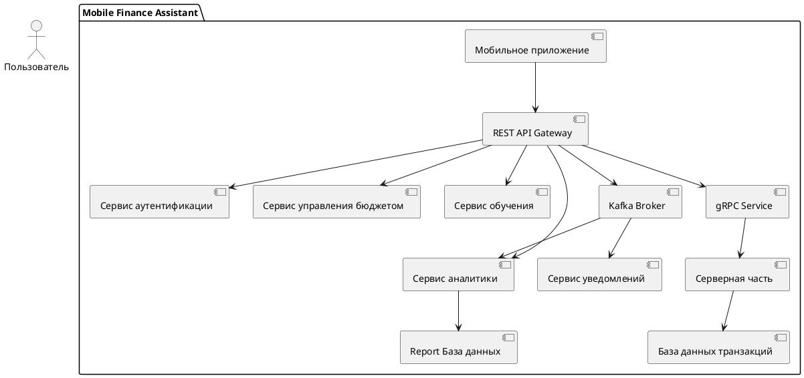
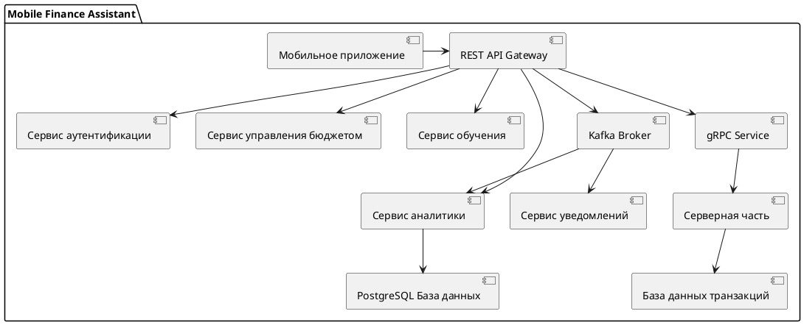
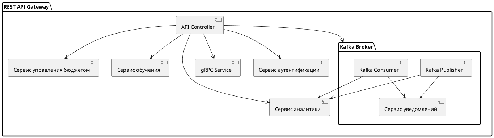
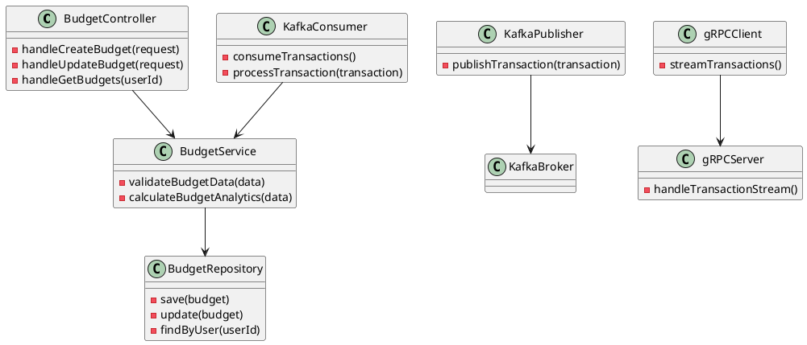

# Архитектура

:::note
Техническая реализация включает в себя следующие технологии:

Мобильное приложение: React Native / Flutter для кроссплатформенной разработки.
Серверная часть: Flask и PostgreSQL для обработки запросов и хранения данных.
Внешние интеграции: REST API для взаимодействия с внешними системами, включая банковские API и учебные платформы.
Безопасность: Использование современных методов шифрования и двухфакторной аутентификац
:::


## C1

Контекстная диаграмма описывает основные элементы системы и их взаимодействие на высоком уровне.



## C2


## C3


## C4


## Внешние зависимости

**| Сервис | Тип интеграции | Описание |
| ------ | -------------- | -------- |
Пользовательская аутентификация	| REST API	| Реализация регистрации, авторизации и управления сессиями пользователей
Банковские API	| REST API |	Интеграция с банковскими системами для получения транзакций и финансовых данных
Платежный шлюз	| REST API | Обработка финансовых транзакций внутри приложения
Учебная платформа |	REST API |	Доступ к материалам и курсам по финансовой грамотности
Уведомления |	WebSocket / REST API |	Отправка уведомлений пользователям о событиях и действиях
**

##### Архитектура асинхронного взаимодействия

- **Событие**: Пользователь совершает транзакцию (например, покупку, перевод или пополнение счета).

- **Действие**: Приложение автоматически отправляет транзакцию в бекенд-систему, которая обрабатывает событие и рассылает его заинтересованным сервисам.

- **Реакция**: Бекенд отправляет уведомления или обновляет данные для аналитики и отчетов в реальном времени.

#### **gRPC (двунаправленный стриминг)**

  **Обоснование**:
gRPC позволяет организовать высокопроизводительное взаимодействие в режиме реального времени, где клиент (банк, которым пользуется клиент) отправляет поток транзакций, а сервер может сразу отвечать.
Использование Protocol Buffers обеспечивает компактный формат передачи данных, снижая нагрузку на сеть.
Высокая производительность для мобильных приложений с низким энергопотреблением.
Возможность стриминга данных между клиентом и сервером.
Компактность сообщений благодаря Protocol Buffers.


### gRPC Протокол для обработки транзакций

```proto
syntax = "proto3";

package transaction;

service TransactionService {
  rpc StreamTransactions(stream Transaction) returns (stream TransactionResponse);
}

message Transaction {
  string transactionId = 1;
  string userId = 2;
  string category = 3;
  float amount = 4;
  string currency = 5;
  string timestamp = 6;
}

message TransactionResponse {
  string transactionId = 1;
  string status = 2; // success or failure
  string message = 3;
}

'''

## C4
'''plantuml
@startuml

actor Client as C

participant "TransactionService" as TS

database "Database" as DB

C -> TS: Open Stream

par Клиент совершает транзакцию

loop Пока отрыт поток сообщений

C -> TS: Transaction {transactionId, userId, category, amount, currency, timestamp}

end

end

par Сервер обрабатывает транзакцию

loop Для каждой транзакции

TS -> DB: Save Transaction

DB --> TS: Acknowledgment

TS --> C: TransactionResponse {transactionId, status="success", message="Processed"}

end

end

C --> TS: Close Stream

@enduml
'''
