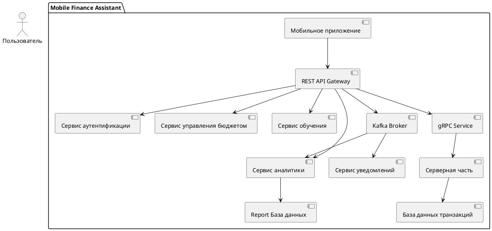
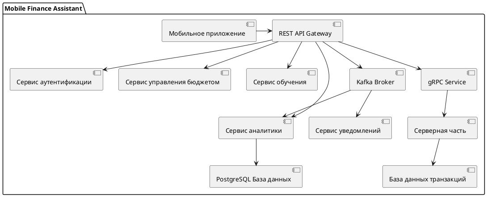
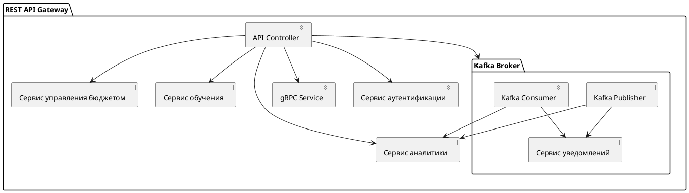
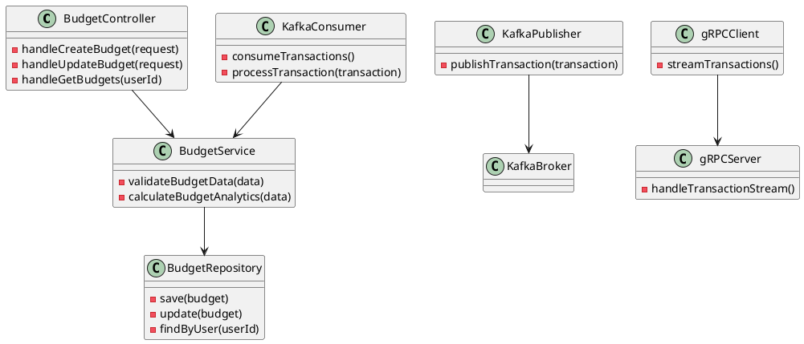

# Архитектура

:::note
Техническая реализация включает в себя следующие технологии:

Мобильное приложение: React Native / Flutter для кроссплатформенной разработки.
Серверная часть: Flask и PostgreSQL для обработки запросов и хранения данных.
Внешние интеграции: REST API для взаимодействия с внешними системами, включая банковские API и учебные платформы.
Безопасность: Использование современных методов шифрования и двухфакторной аутентификац
:::

## C1

Контекстная диаграмма описывает основные элементы системы и их взаимодействие на высоком уровне.

## C2

## C3

## C4

## Внешние зависимости

| Сервис | Тип интеграции | Описание |
| ------ | -------------- | -------- |
Пользовательская аутентификация	| REST API	| Реализация регистрации, авторизации и управления сессиями пользователей
Банковские API	| REST API |	Интеграция с банковскими системами для получения транзакций и финансовых данных
Платежный шлюз	| REST API | Обработка финансовых транзакций внутри приложения
Учебная платформа |	REST API |	Доступ к материалам и курсам по финансовой грамотности
Уведомления |	WebSocket / REST API |	Отправка уведомлений пользователям о событиях и действиях

#### **gRPC для клиент-серверного взаимодействия**

**Задача**: Быстрое получение транзакций от мобильного приложения.

**Почему gRPC**:

  Мобильное приложение взаимодействует с сервером в режиме реального времени.

  Двунаправленный стриминг gRPC позволяет:

    Клиенту отправлять транзакции сразу при их создании.

    Серверу немедленно возвращать ответы о статусе обработки (например, "успешно сохранено").

  Клиенту отправлять транзакции сразу при их создании.

  Легкость интеграции gRPC с мобильными платформами (Android, iOS).

**Пример потока данных**:

Пользователь совершает транзакцию → мобильное приложение отправляет данные через gRPC.

Сервер принимает транзакцию, сохраняет ее в базу данных и возвращает подтверждение клиенту.

#### **Kafka для обработки транзакций и интеграции микросервисов**

**Задача**: Асинхронная обработка и распространение данных о транзакциях между различными компонентами системы.

**Почему Kafka**:

  После сохранения транзакций через gRPC сервер может публиковать события в Kafka-топик transactions для дальнейшей обработки.

  Kafka позволяет:

    Распределить нагрузку между сервисами (аналитика, уведомления).

    Сохранять сообщения для ретрансляции или повторной обработки.

  Подходит для построения микросервисной архитектуры, где разные компоненты подписываются на интересующие их топики.

**Пример потока данных**:

1. Сервер публикует событие о новой транзакции в Kafka-топик transactions

2. Сервис аналитики подписывается на топик, обрабатывает данные и генерирует агрегированные отчеты.

3. Сервис уведомлений отправляет пользователю сообщение о завершении операции.

Итого путь выглядит вот так

Мобильное приложение → gRPC → Сервер → База данных.

После подтверждения сервер публикует событие в Kafka .

Подписчики Kafka:

- **Сервис аналитики**: Обрабатывает транзакции, агрегирует данные, публикует отчеты в топик analytics_reports

- **Сервис уведомлений**: Формирует уведомления для пользователей.

То есть технологии используются следующим образом:

**gRPC для сбора транзакций** между клиентом и сервером для быстрой передачи и получения данных.

**Kafka для обработки транзакций** между компонентами системы (например, аналитика, уведомления).

Это комбинированное решение позволяет объединить преимущества обеих технологий:

**gRPC обеспечивает минимальные задержки** при получении данных от клиента.

**Kafka позволяет масштабировать систему** для асинхронной обработки и интеграции

