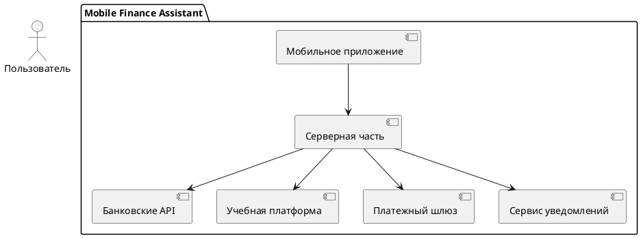
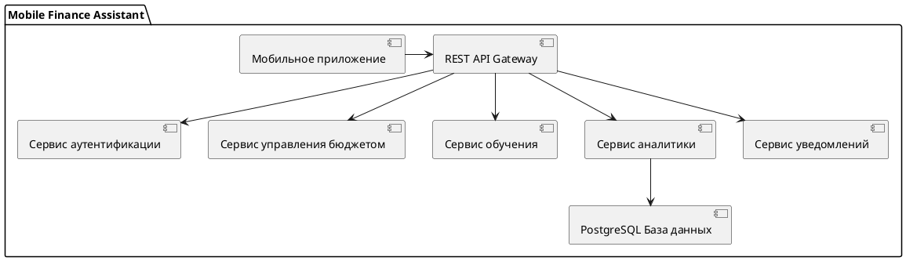
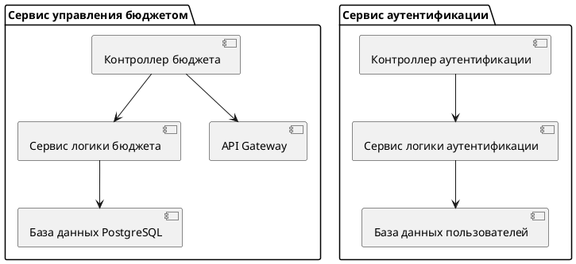
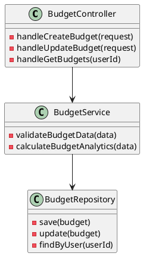

# Архитектура

:::note
Техническая реализация включает в себя следующие технологии:

Мобильное приложение: React Native / Flutter для кроссплатформенной разработки.
Серверная часть: Flask и PostgreSQL для обработки запросов и хранения данных.
Внешние интеграции: REST API для взаимодействия с внешними системами, включая банковские API и учебные платформы.
Безопасность: Использование современных методов шифрования и двухфакторной аутентификац
:::

## C1

Контекстная диаграмма описывает основные элементы системы и их взаимодействие на высоком уровне.

## C2

## C3

## C4

## Внешние зависимости

| Сервис | Тип интеграции | Описание |
| ------ | -------------- | -------- |
Пользовательская аутентификация	| REST API	| Реализация регистрации, авторизации и управления сессиями пользователей
Банковские API	| REST API |	Интеграция с банковскими системами для получения транзакций и финансовых данных
Платежный шлюз	| REST API | Обработка финансовых транзакций внутри приложения
Учебная платформа |	REST API |	Доступ к материалам и курсам по финансовой грамотности
Уведомления |	WebSocket / REST API |	Отправка уведомлений пользователям о событиях и действиях