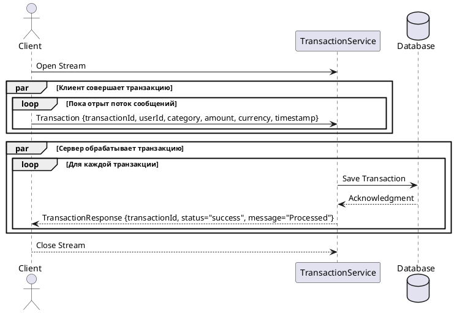

##### Архитектура асинхронного взаимодействия

- **Событие**: Пользователь совершает транзакцию (например, покупку, перевод или пополнение счета).

- **Действие**: Приложение автоматически отправляет транзакцию в бекенд-систему, которая обрабатывает событие и рассылает его заинтересованным сервисам.

- **Реакция**: Бекенд отправляет уведомления или обновляет данные для аналитики и отчетов в реальном времени.

#### **gRPC (двунаправленный стриминг)**

  **Обоснование**:
gRPC позволяет организовать высокопроизводительное взаимодействие в режиме реального времени, где клиент (банк, которым пользуется клиент) отправляет поток транзакций, а сервер может сразу отвечать.
Использование Protocol Buffers обеспечивает компактный формат передачи данных, снижая нагрузку на сеть.
Высокая производительность для мобильных приложений с низким энергопотреблением.
Возможность стриминга данных между клиентом и сервером.
Компактность сообщений благодаря Protocol Buffers.


### gRPC Протокол для обработки транзакций

```proto
syntax = "proto3";

package transaction;

service TransactionService {
  rpc StreamTransactions(stream Transaction) returns (stream TransactionResponse);
}

message Transaction {
  string transactionId = 1;
  string userId = 2;
  string category = 3;
  float amount = 4;
  string currency = 5;
  string timestamp = 6;
}

message TransactionResponse {
  string transactionId = 1;
  string status = 2; // success or failure
  string message = 3;
}
```

## Пример взаимодействия

## Обработка на клиенте
```python
import grpc
from transaction_pb2 import Transaction
from transaction_pb2_grpc import TransactionServiceStub

def stream_transactions():
    # Создание транзакций
    transactions = [
        Transaction(transactionId="1", userId="user123", category="Food", amount=50.0, currency="USD", timestamp="2024-11-17T12:00:00Z"),
        Transaction(transactionId="2", userId="user123", category="Transport", amount=20.0, currency="USD", timestamp="2024-11-17T12:10:00Z")
    ]
    
    for transaction in transactions:
        yield transaction

with grpc.insecure_channel('localhost:50051') as channel:
    stub = TransactionServiceStub(channel)
    responses = stub.StreamTransactions(stream_transactions())
    for response in responses:
        print(f"Response: {response.transactionId}, Status: {response.status}, Message: {response.message}")
```
## Обработка на сервер
```python
import grpc
from concurrent import futures
from transaction_pb2 import TransactionResponse
from transaction_pb2_grpc import TransactionServiceServicer, add_TransactionServiceServicer_to_server

class TransactionService(TransactionServiceServicer):
    def StreamTransactions(self, request_iterator, context):
        for transaction in request_iterator:
            # Асинхронная обработка транзакции
            print(f"Processing Transaction: {transaction.transactionId}")
            yield TransactionResponse(
                transactionId=transaction.transactionId,
                status="success",
                message="Transaction processed successfully"
            )

server = grpc.server(futures.ThreadPoolExecutor(max_workers=10))
add_TransactionServiceServicer_to_server(TransactionService(), server)
server.add_insecure_port('[::]:50051')
server.start()
server.wait_for_termination()
```