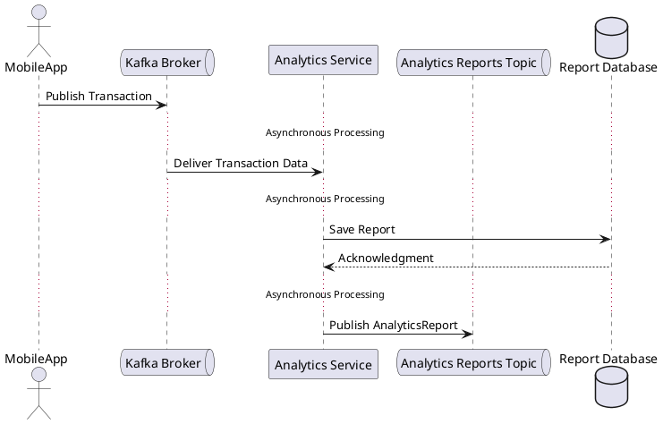

**Публикация сообщений в Kafka**:

Когда мобильное приложение публикует транзакцию в Kafka-топик transactions, сообщение сохраняется в брокере Kafka. Это действие **асинхронно**, так как приложение не ожидает немедленного ответа от потребителя (сервиса аналитики). Оно может продолжить выполнение других задач.

Kafka обрабатывает доставку сообщений потребителям (например, сервису аналитики) независимо от публикации. Это обеспечивает **разделение отправки и обработки сообщений**, что является ключевым элементом асинхронности.

Сервис аналитики получает сообщения из Kafka в своем собственном темпе (например, используя стратегию обработки "batch" или "streaming").

Он обрабатывает каждое сообщение независимо и не зависит от отправителя (мобильного приложения).

**Публикация отчетов в другой топик**  cервис аналитики публикует обработанные отчеты в новый Kafka-топик (analytics_reports). Это также выполняется **асинхронно**: ни Kafka, ни мобильное приложение не ждут завершения обработки.

Любой другой компонент системы (например, отчетный сервис) может подписаться на топик  analytics_reports и обрабатывать данные в своем темпе, не влияя на отправителя (аналитический сервис).



## Apache avro схема для транзакции

```json
{
  "type": "record",
  "name": "Transaction",
  "namespace": "com.example.transaction",
  "fields": [
    { "name": "transactionId", "type": "string", "doc": "Уникальный идентификатор транзакции" },
    { "name": "userId", "type": "string", "doc": "Уникальный идентификатор пользователя" },
    { "name": "category", "type": "string", "doc": "Категория транзакции" },
    { "name": "amount", "type": "float", "doc": "Сумма транзакции" },
    { "name": "currency", "type": "string", "doc": "Валюта транзакции" },
    { "name": "timestamp", "type": "string", "doc": "Время создания транзакции" }
  ]
}
```

## Apache avro схема для отчета

```json
{
  "type": "record",
  "name": "AnalyticsReport",
  "namespace": "com.example.analytics",
  "fields": [
    { "name": "userId", "type": "string", "doc": "Уникальный идентификатор пользователя" },
    { "name": "category", "type": "string", "doc": "Категория расходов" },
    { "name": "totalAmount", "type": "float", "doc": "Общая сумма расходов по категории" },
    { "name": "currency", "type": "string", "doc": "Валюта" },
    { "name": "reportTimestamp", "type": "string", "doc": "Время создания отчета" }
  ]
}
```

## Публикация на python 

```python
from confluent_kafka import Producer
import json
import uuid
from datetime import datetime

producer = Producer({'bootstrap.servers': 'localhost:9092'})

transaction = {
    "transactionId": str(uuid.uuid4()),
    "userId": "user-123",
    "category": "Food",
    "amount": 150.0,
    "currency": "USD",
    "timestamp": datetime.utcnow().isoformat()
}

producer.produce(
    'transactions',
    key=transaction['transactionId'],
    value=json.dumps(transaction),
    callback=lambda err, msg: print(f"Delivered: {msg.topic()} [{msg.partition()}]") if not err else print(f"Error: {err}")
)

producer.flush()
```

## Обработка
```python
from confluent_kafka import Consumer, Producer
import json
from datetime import datetime
consumer = Consumer({
    'bootstrap.servers': 'localhost:9092',
    'group.id': 'analytics-group',
    'auto.offset.reset': 'earliest'
})
producer = Producer({'bootstrap.servers': 'localhost:9092'})
consumer.subscribe(['transactions'])
while True:
    msg = consumer.poll(1.0)
    if msg is None:
        continue
    if msg.error():
        print(f"Error: {msg.error()}")
        continue
    transaction = json.loads(msg.value().decode('utf-8'))
    print(f"Processing transaction: {transaction}")
    # Пример обработки данных
    report = {
        "userId": transaction["userId"],
        "category": transaction["category"],
        "totalAmount": transaction["amount"],  # Пример агрегации
        "currency": transaction["currency"],
        "reportTimestamp": datetime.utcnow().isoformat()
    }
    producer.produce(
        'analytics_reports',
        key=report["userId"],
        value=json.dumps(report),
        callback=lambda err, msg: print(f"Delivered: {msg.topic()} [{msg.partition()}]") if not err else print(f"Error: {err}")
    )
    producer.flush()
consumer.close()
```
