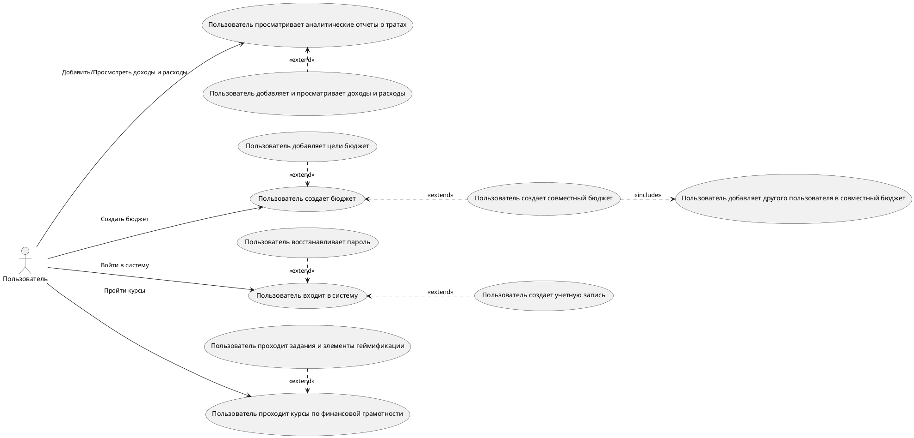

# Диаграмма Use Case для Mobile Finance Assistant

## Описание процесса регистрации

### Начало процесса регистрации
1. **Пользователь** нажимает на кнопку регистрации.
2. **Графический интерфейс** отправляет запрос на вывод графического отображения страницы регистрации.
3. **Система** выводит информацию о странице регистрации.
4. **Графический интерфейс** отображает страницу регистрации пользователю.

### Ввод данных
1. **Пользователь** вводит свои данные (email, пароль).
2. **Графический интерфейс** передает данные (email, пароль) в систему.
3. **Система** проверяет данные:
   - Если данные неверны, система отправляет ошибку на экран.
   - Если данные верны, система проверяет уникальность email в базе данных.

### Генерация и отправка кода подтверждения
1. **Система** генерирует код подтверждения.
2. **Система** отправляет код на email пользователя.
3. **Система** сохраняет код подтверждения в базе данных.

### Ввод кода подтверждения
1. **Пользователь** вводит код подтверждения.
2. **Графический интерфейс** передает код в систему.
3. **Система** проверяет код подтверждения в базе данных:
   - Если код неправильный, система отправляет сообщение об ошибке.
   - Если код правильный, система сохраняет учетную запись и активирует её.

### Ошибки и проблемы
1. Если возникает проблема с регистрацией, система отправляет сообщение об ошибке в **ИТ систему поддержки (Jira)**.
2. **ИТ система поддержки (Jira)** подтверждает получение сообщения.

## Статус регистрации
- Процесс завершен успешно, если код подтверждения правильный и учетная запись активирована.
