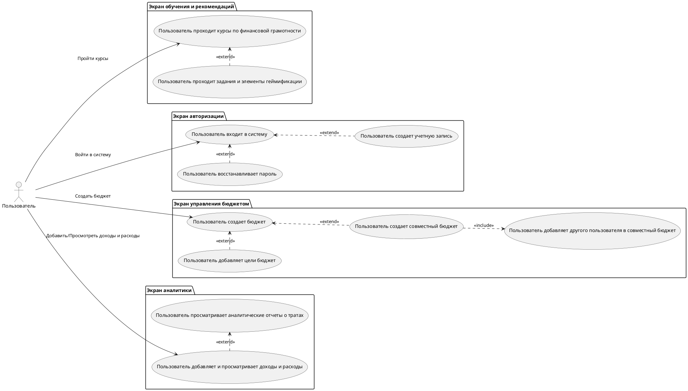

# Диаграмма Use Case для Mobile Finance Assistant

## Описание Use Case

### Регистрация пользователя
- **Описание**: Пользователь создает учетную запись в системе для получения доступа ко всем функциям приложения.

### Вход в систему
- **Описание**: Пользователь входит в свою учетную запись для доступа к личному кабинету.

### Отслеживание доходов и расходов
- **Описание**: Пользователь добавляет и просматривает свои доходы и расходы для контроля за финансовыми потоками.

### Персонализированное обучение
- **Описание**: Пользователь проходит курсы по финансовой грамотности для улучшения знаний в управлении личными финансами.

### Выполнение заданий
- **Описание**: Пользователь выполняет задания, связанные с обучением и геймификацией, что способствует усвоению материала.

### Восстановление пароля
- **Описание**: Пользователь восстанавливает свой пароль в случае его утраты или забытия.

### Создание бюджета
- **Описание**: Пользователь создает личный бюджет для управления своими финансами.

### Создание совместного бюджета
- **Описание**: Пользователь создает совместный бюджет для управления финансами группы (например, семьи).

### Добавление пользователя в совместный бюджет
- **Описание**: Пользователь добавляет других участников в совместный бюджет для учета их расходов.

### Установка целей
- **Описание**: Пользователь устанавливает цели для своего бюджета, такие как накопление на конкретные нужды.

### Аналитика
- **Описание**: Пользователь просматривает аналитические отчеты о своих расходах и доходах, чтобы оценить финансовое положение.

## Взаимодействия между действиями
1. **Регистрация пользователя** может быть расширена через **Вход в систему**.
2. **Выполнение заданий** расширяет **Персонализированное обучение**.
3. **Восстановление пароля** расширяет **Вход в систему**.
4. **Создание совместного бюджета** расширяет **Создание бюджета**.
5. **Установка целей** расширяет **Создание бюджета**.
6. **Добавление пользователя** является обязательным шагом при создании **Совместного бюджета**.
7. **Отслеживание доходов и расходов** может быть расширено через **Аналитику**.
